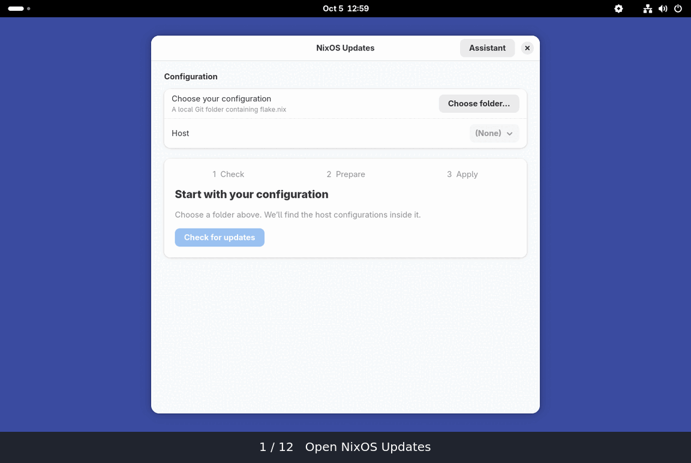

# NixOS Update Manager

A native GNOME app for checking, preparing, and reviewing updates to your local NixOS flake Git repository. See package version changes before applying the prepared system, with an optional lock-only commit.

**Development preview:** no stable release is available yet. Compatibility, interruption recovery, and accessibility checks remain open. See [implementation status](docs/STATUS.md) and [release gates](docs/RELEASING.md).

## Walkthrough



Choose your configuration folder and host → **Check for updates** → **Prepare update** → review → **Apply**. Preparation continues with the window closed; its completion notification returns you to the review.

This 45-second GIF contains twelve real guest screenshots, with waiting omitted. It predates the rename, grouped package review, and current Settings flow. See the [current grouped review](docs/evidence/ui-grouped-packages.png), [Settings capture](docs/evidence/ui-assistant-settings.png), and [capture notes](docs/walkthrough/README.md). The contextual explanation capture uses a synthetic model fixture.

## Try it

```sh
nix run github:oddship/nixos-update-manager
```

The app needs a local Git repository with at least one commit, tracked `flake.nix` and `flake.lock`, plus a host under `nixosConfigurations`. Check finds input changes without building the whole system. Prepare builds the candidate for review. Both preserve your checkout and index. Tracked local edits are included; ignored and untracked files are excluded. No Home Manager setup or agent is required.

The tested scope is x86_64-linux, pinned unstable Nixpkgs, Nix 2.34.8, and GNOME 50.4. Stable NixOS and other architectures have not been validated. See [supported inputs and restrictions](docs/USAGE.md#current-restrictions).

## Install with your NixOS configuration

Add the input and module to your flake, for example `~/nix-system/flake.nix`. Use your existing Nixpkgs input and host name in place of this example:

```nix
{
  inputs.nixpkgs.url = "github:NixOS/nixpkgs/nixos-unstable";
  inputs.nixos-update-manager.url = "github:oddship/nixos-update-manager";

  outputs = { nixpkgs, nixos-update-manager, ... }: {
    nixosConfigurations.demo = nixpkgs.lib.nixosSystem {
      system = "x86_64-linux";
      modules = [
        ./configuration.nix
        nixos-update-manager.nixosModules.default
        { services.nixos-update-manager.enable = true; }
      ];
    };
  };
}
```

The module installs `nixos-update-manager`, its root helper, and the polkit policy needed for authenticated Apply. Apply activates the retained system you reviewed. An optional commit changes only the reviewed lock file and preserves unrelated staged and working changes. If committing fails after Apply, you can retry the commit separately. Read [usage and recovery](docs/USAGE.md) before applying an update.

## Optional GNOME indicator

The GNOME 50 extension shows the last checked host's recorded status and opens the app. Install it through the module:

```nix
services.nixos-update-manager.indicator.enable = true;
```

After rebuilding and logging back in, enable **NixOS Update Manager** in GNOME Extensions or run:

```sh
gnome-extensions enable nixos-updates@oddship.github.io
```

The module leaves extension activation to you. The indicator reads the default app state directory, does not support custom `--state-dir` locations, and never checks or applies updates itself.

## Optional explanations

Pi 1.0 is included in the default package. Open **Settings** and click **Test connection** to send a fixed short request to your existing Pi model, without update data. Success enables **Explain this update** beside the prepared update actions. Explanation sends only the update phase, input names, and up to 200 package changes; it excludes files, paths, hashes, and error logs. **Account and model** holds the override and **Open Pi** controls for `/login` and `/model`. Retest after changing your account/model in Pi: saved status reflects the last successful test, not live account health. No request runs just from opening Settings. Chat and source repair are unavailable; real provider integration remains unverified. See [assistant details](docs/USAGE.md#update-assistant).

## Local development

From a clone of this repository:

```sh
nix develop
just run
just lint
just test
```

`just run` reuses the incremental Cargo build; `nix run .` uses the packaged app. One app provides both the GUI and CLI commands, and one Nix package includes it, Pi, and the privileged helper. The first build still needs dependencies and compilation.

Builds default to two compiler jobs and one Nix derivation with two build cores, at lower scheduling priority. App-issued Nix builds also use one derivation and two cores. These limit concurrency, not CPU usage with a hard quota. Use `just jobs=1 build` for a smaller machine. Run `just --list` for the other commands.

Existing state, desktop/D-Bus identity, extension UUID, environment variables, and authorization identifiers remain compatible with the former name. Legacy binary and module-option aliases are retained; see [compatibility identifiers](docs/USAGE.md#compatibility-identifiers).

[Contributing](CONTRIBUTING.md) · [Security reporting](SECURITY.md) · [Changelog](CHANGELOG.md) · [Architecture](SPEC.md)

Licensed under [MIT](LICENSE).
